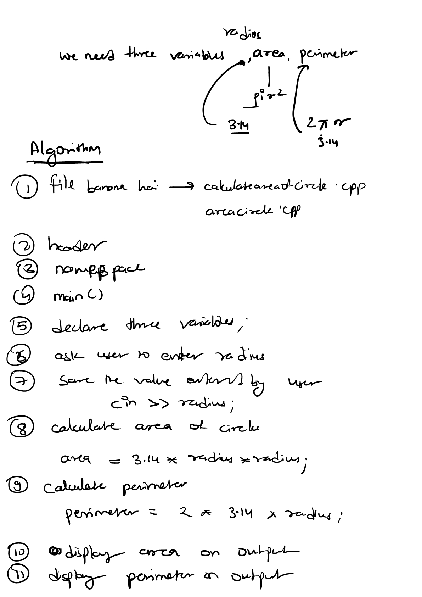

1. Basic way to write steps of program, before writing code.
2. It will help in identifying the statements that we ned to perform.
3. Below are the steps to solve question 3

4. Link to [practice-questions](./day9-operator/Practice-Question.md)