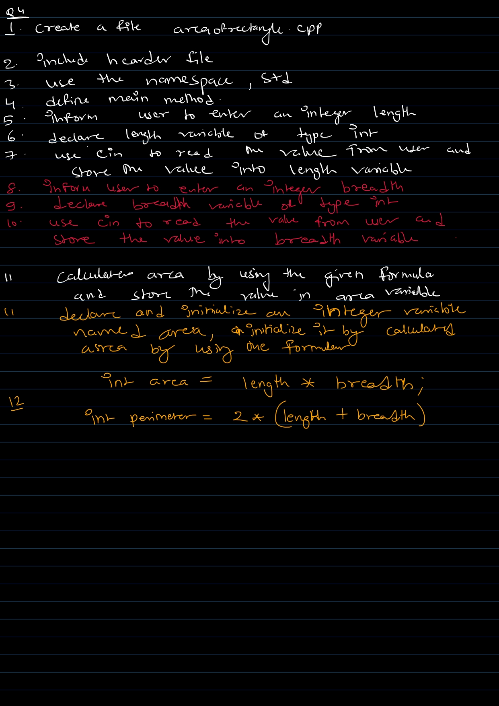

1. Basic way to write steps of program, before writing code.
2. It will help in identifying the statements that we need to perform.
3. Below are the steps to solve question 3

4. Below are the steps to solve question 4

5. Link to [practice-questions](./day9-operator/Practice-Question.md)